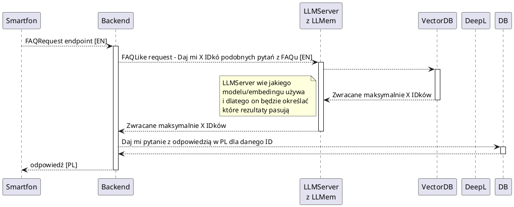

```plantuml
@startuml
participant Smartfon
participant Backend
participant "LLMServer\nz LLMem" as LLMServer
participant VectorDB
participant DeepL


Smartfon --> Backend: FAQRequest endpoint [EN]
activate Backend


Backend --> LLMServer: FAQLike request - Daj mi X IDkó podobnych pytań z FAQu [EN]
activate LLMServer
LLMServer --> VectorDB
activate VectorDB
VectorDB --> LLMServer: Zwracane maksymalnie X IDków
note left
    LLMServer wie jakiego
    modelu/embedingu używa
    i dlatego on będzie określać
    które rezultaty pasują
end note
deactivate VectorDB

LLMServer --> Backend: Zwracane maksymalnie X IDków
deactivate LLMServer

Backend --> DB: Daj mi pytanie z odpowiedzią w PL dla danego ID
activate DB
DB --> Backend
deactivate DB


Backend --> Smartfon: odpowiedź [PL]
deactivate Backend

@enduml
```