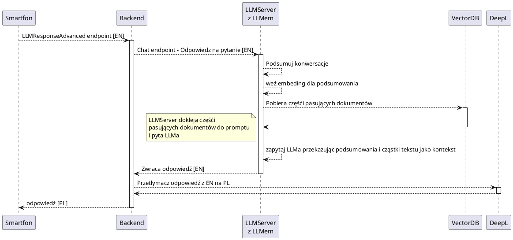

```plantuml
@startuml
participant Smartfon
participant Backend
participant "LLMServer\nz LLMem" as LLMServer
participant VectorDB
participant DeepL


Smartfon --> Backend:  LLMResponseAdvanced endpoint [EN]
deactivate Smartfon
activate Backend


Backend --> LLMServer: Chat endpoint - Odpowiedz na pytanie [EN]
activate LLMServer
LLMServer --> LLMServer: Podsumuj konwersacje
LLMServer --> LLMServer: weź embeding dla podsumowania
LLMServer --> VectorDB: Pobiera częśći pasujących dokumentów
activate VectorDB
VectorDB --> LLMServer:
note left
    LLMServer dokleja częśći
    pasujących dokumentów do promptu
    i pyta LLMa
end note
deactivate VectorDB
LLMServer --> LLMServer: zapytaj LLMa przekazując podsumowania i cząstki tekstu jako kontekst
LLMServer --> Backend: Zwraca odpowiedź [EN]
deactivate LLMServer

Backend --> DeepL: Przetłymacz odpowiedź z EN na PL
activate DeepL
DeepL --> Backend
deactivate DeepL

Backend --> Smartfon: odpowiedź [PL]
deactivate Backend

@enduml
```