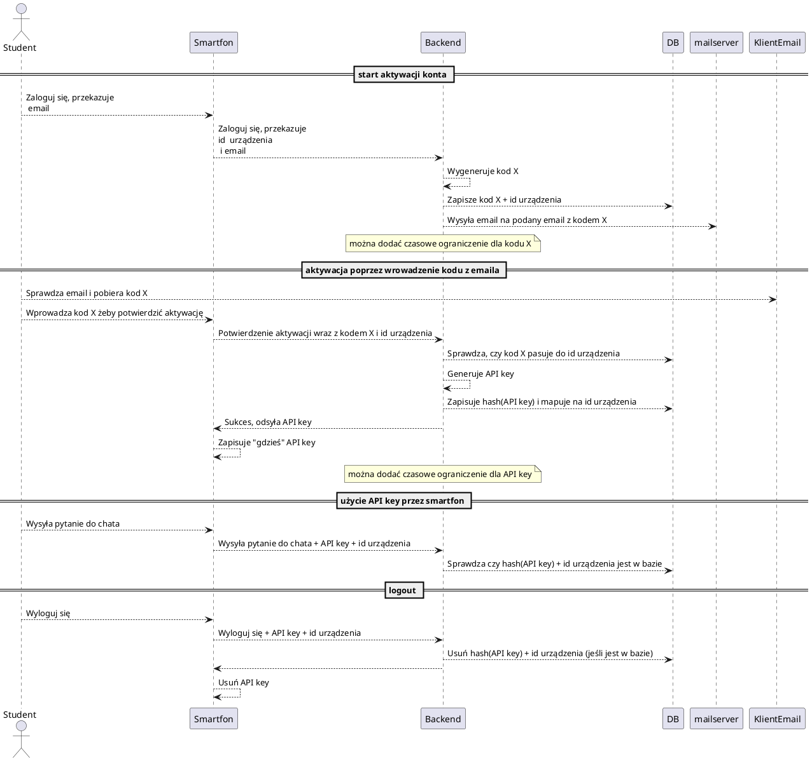

```plantuml
@startuml
actor Student

== start aktywacji konta ==

Student --> Smartfon: Zaloguj się, przekazuje\n email

Smartfon --> Backend: Zaloguj się, przekazuje\nid  urządzenia\n i email

Backend --> Backend: Wygeneruje kod X

Backend --> DB: Zapisze kod X + id urządzenia

Backend --> mailserver: Wysyła email na podany email z kodem X

note over Backend: można dodać czasowe ograniczenie dla kodu X

== aktywacja poprzez wrowadzenie kodu z emaila ==

Student --> KlientEmail: Sprawdza email i pobiera kod X

Student --> Smartfon: Wprowadza kod X żeby potwierdzić aktywację

Smartfon --> Backend: Potwierdzenie aktywacji wraz z kodem X i id urządzenia

Backend --> DB: Sprawdza, czy kod X pasuje do id urządzenia

Backend --> Backend: Generuje API key

Backend --> DB: Zapisuje hash(API key) i mapuje na id urządzenia

Backend --> Smartfon: Sukces, odsyła API key

Smartfon --> Smartfon: Zapisuje "gdzieś" API key

note over Backend: można dodać czasowe ograniczenie dla API key

== użycie API key przez smartfon ==

Student --> Smartfon: Wysyła pytanie do chata

Smartfon --> Backend: Wysyła pytanie do chata + API key + id urządzenia

Backend --> DB: Sprawdza czy hash(API key) + id urządzenia jest w bazie

== logout ==

Student --> Smartfon: Wyloguj się

Smartfon --> Backend: Wyloguj się + API key + id urządzenia

Backend --> DB: Usuń hash(API key) + id urządzenia (jeśli jest w bazie)

Backend --> Smartfon

Smartfon --> Smartfon: Usuń API key

@enduml
```
