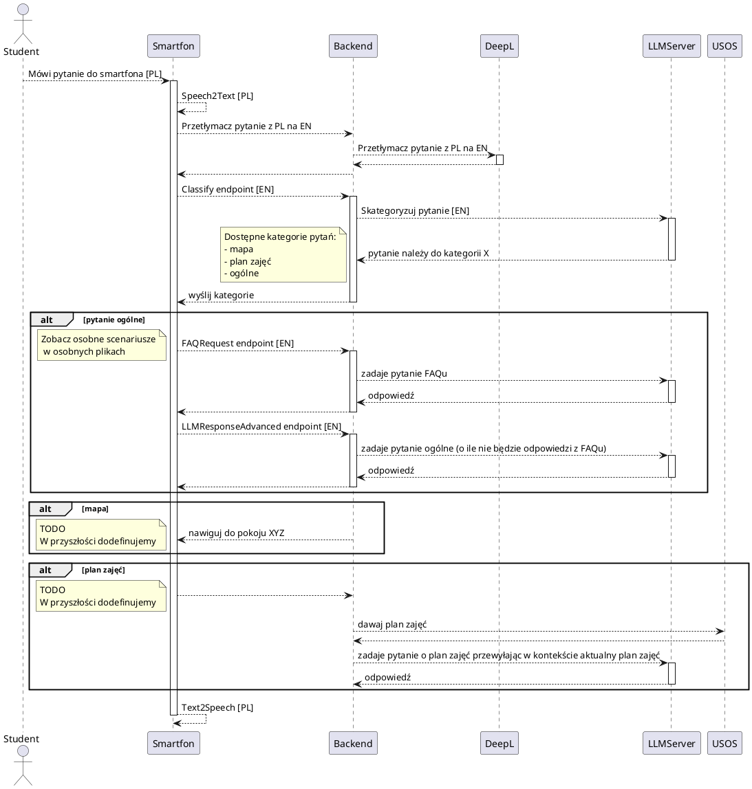

```plantuml
@startuml
actor Student

Student --> Smartfon: Mówi pytanie do smartfona [PL]
activate Smartfon

Smartfon --> Smartfon: Speech2Text [PL]

Smartfon --> Backend: Przetłymacz pytanie z PL na EN

Backend --> DeepL: Przetłymacz pytanie z PL na EN
activate DeepL
DeepL --> Backend
deactivate DeepL

Backend --> Smartfon

Smartfon --> Backend: Classify endpoint [EN]
activate Backend


Backend --> LLMServer: Skategoryzuj pytanie [EN]
activate LLMServer
LLMServer --> Backend: pytanie należy do kategorii X
deactivate LLMServer
note left
Dostępne kategorie pytań:
- mapa
- plan zajęć
- ogólne
end note

Backend --> Smartfon: wyślij kategorie
deactivate Backend


alt pytanie ogólne

    Smartfon --> Backend: FAQRequest endpoint [EN]
    activate Backend
note left
Zobacz osobne scenariusze
 w osobnych plikach
end note

    Backend --> LLMServer: zadaje pytanie FAQu
    activate LLMServer
    LLMServer --> Backend: odpowiedź
    deactivate LLMServer

    Backend --> Smartfon
    deactivate Backend

    Smartfon --> Backend: LLMResponseAdvanced endpoint [EN]
    activate Backend

    Backend --> LLMServer: zadaje pytanie ogólne (o ile nie będzie odpowiedzi z FAQu)
    activate LLMServer
    LLMServer --> Backend: odpowiedź
    deactivate LLMServer

    Backend --> Smartfon

    deactivate Backend
end

alt mapa

    activate Smartfon
    Backend --> Smartfon: nawiguj do pokoju XYZ
note left
TODO
W przyszłości dodefinujemy
end note
end

alt plan zajęć

    Smartfon --> Backend
note left
TODO
W przyszłości dodefinujemy
end note
    Backend --> USOS: dawaj plan zajęć
    USOS --> Backend

    Backend --> LLMServer: zadaje pytanie o plan zajęć przewyłając w kontekście aktualny plan zajęć
    activate LLMServer
    LLMServer --> Backend: odpowiedź
    deactivate LLMServer
end

Smartfon --> Smartfon: Text2Speech [PL]

deactivate Smartfon
@enduml
```